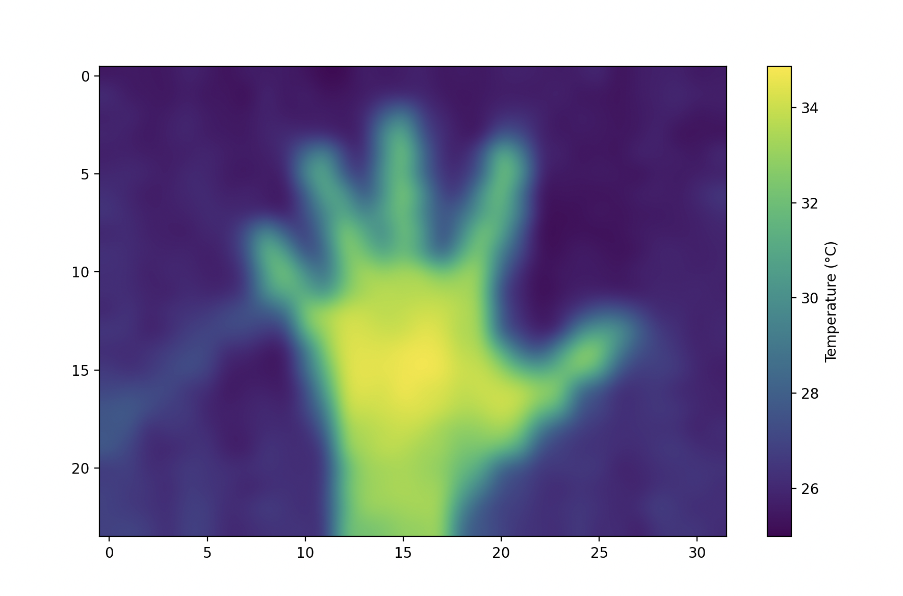

# MLX90640 Python Driver

This code uses the Arduino as a simple I2C to Serial relay, leaving all of the
calibration and image processing to Python code running on the PC host.

(ATmega-based Arduinos like the Arduino Nano do not have enough RAM to hold the
16-bit 32x24px image in memory, so the usual MLX90640 libraries do not work.)

### Usage

    python MLX90640.py /dev/tty.usbserial-XXX

### Screenshot

